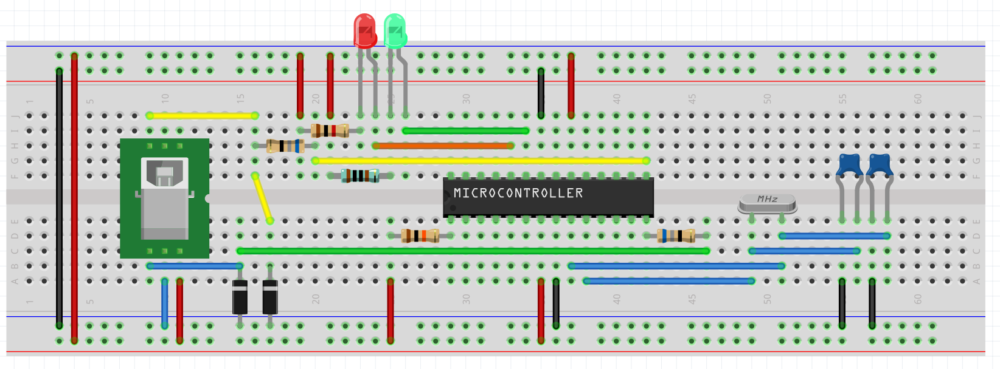
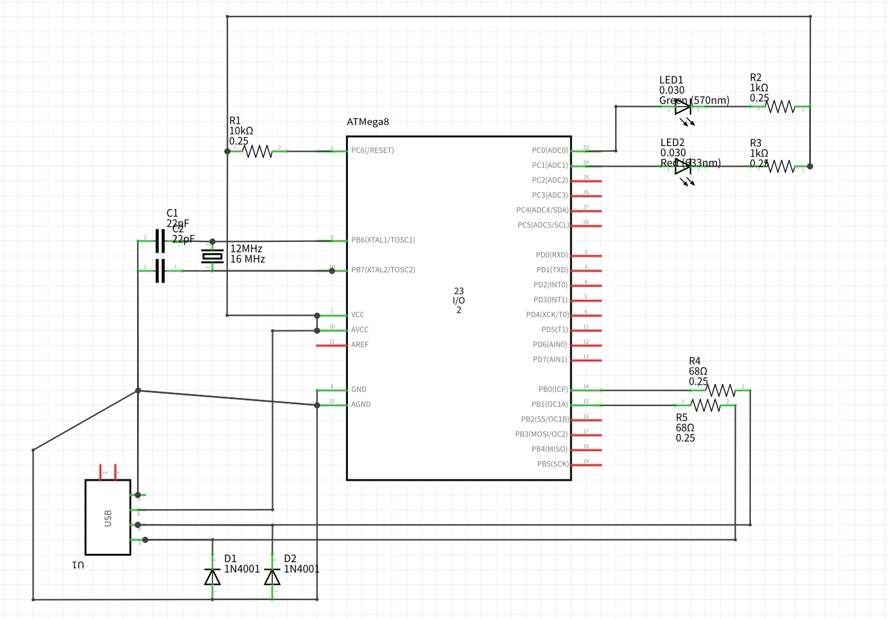
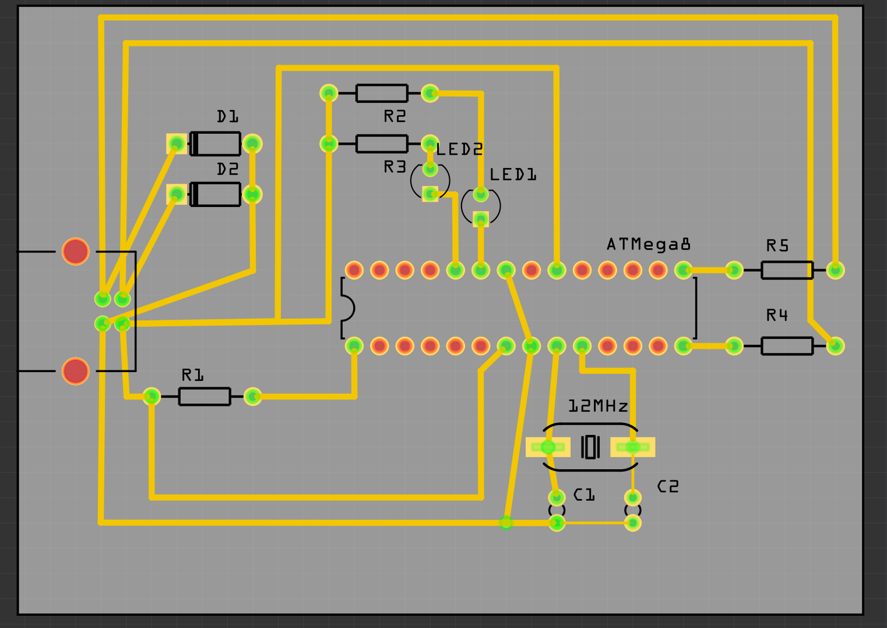
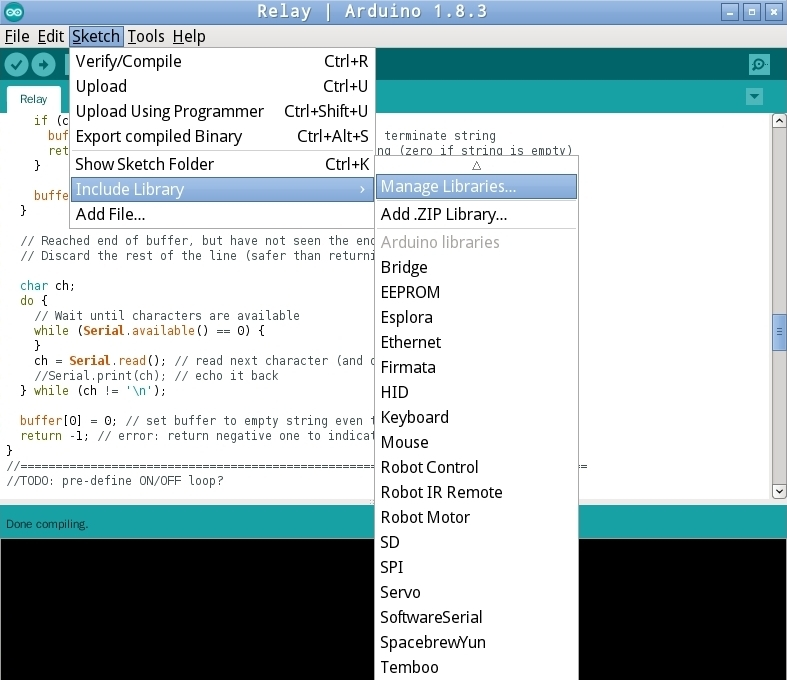
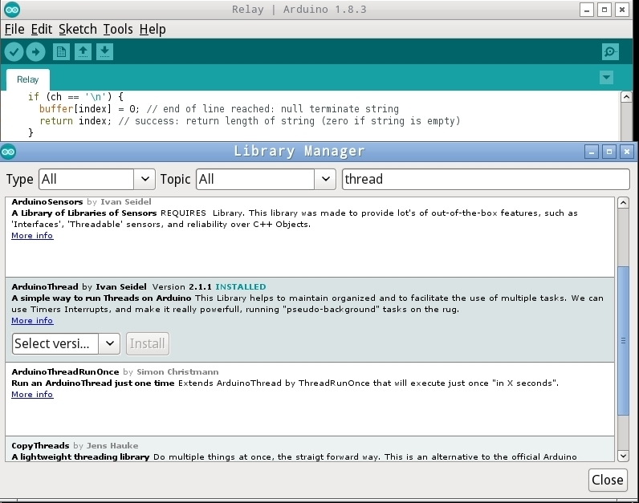
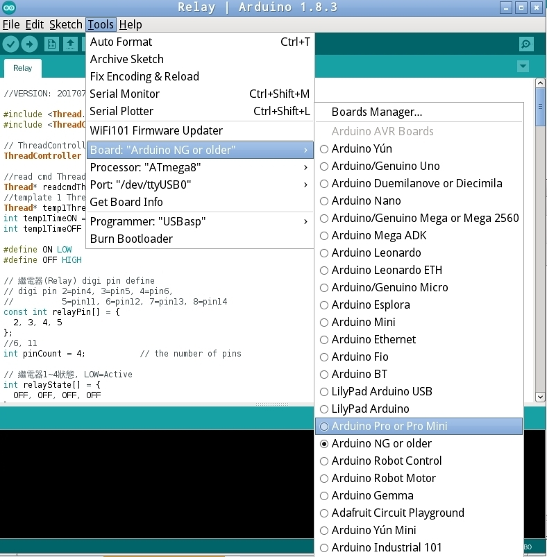
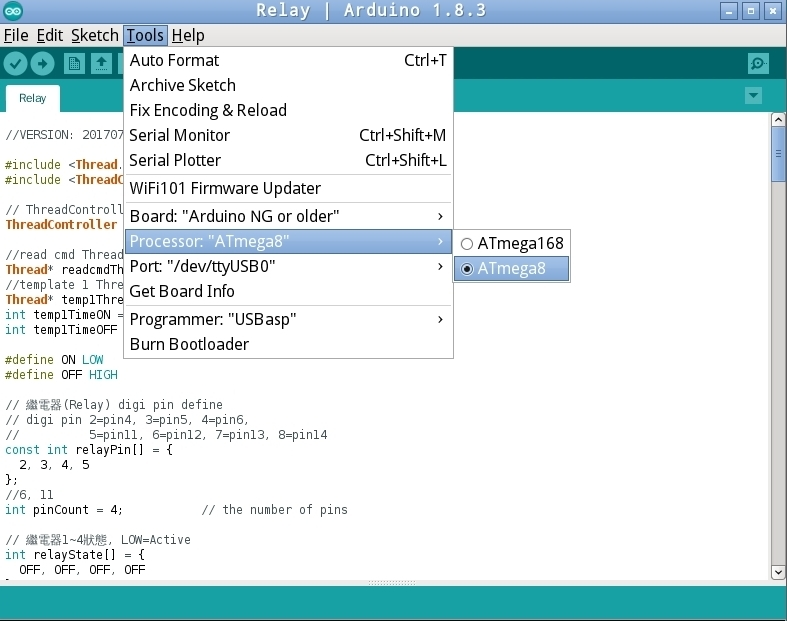
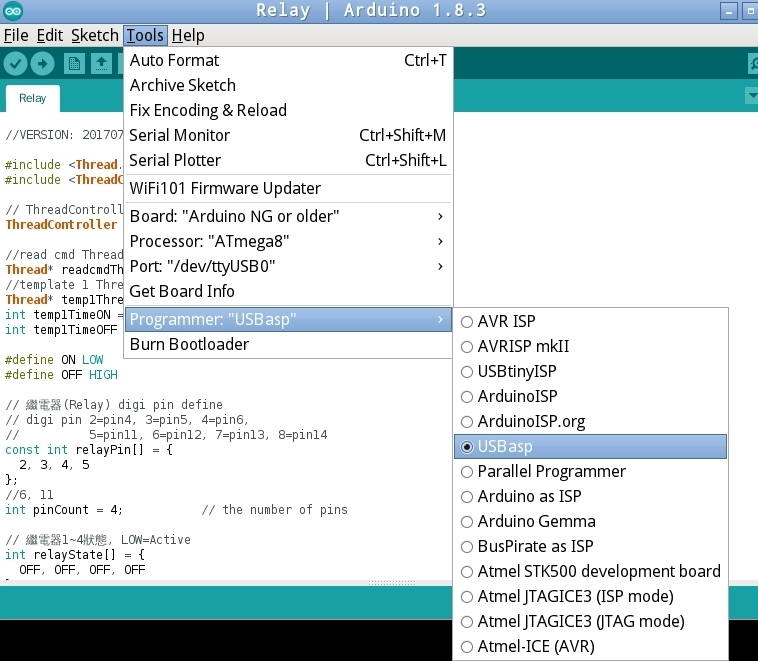
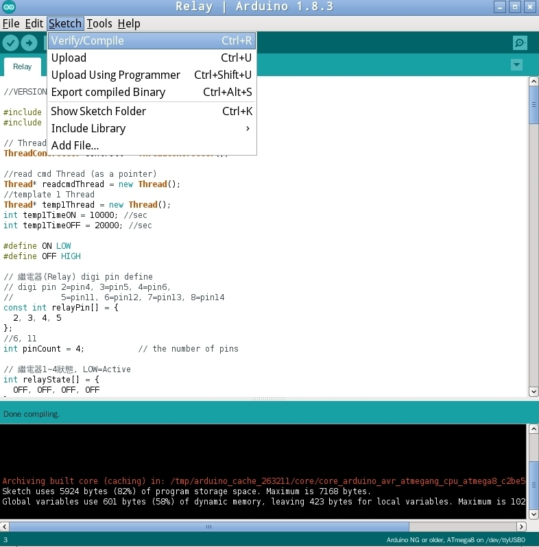
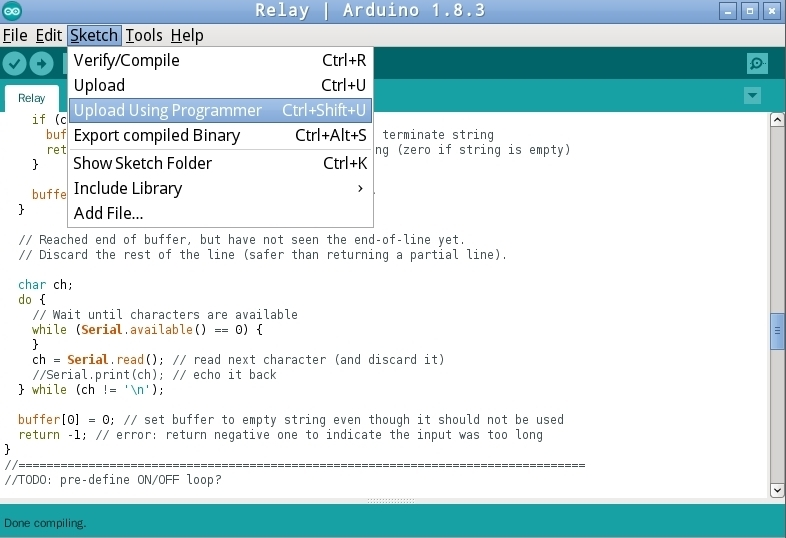

# relayDuino
USBasp+ control power on/off relay

# Requirement
	# require package gcc-avr avrdude fritzing
	sudo apt install gcc-avr avr-libc
	sudo apt install avrdude
# build Hardware
	# use fritzing to check USBasp+.fzz
	
	
	
# burn usbasp+ (only do once)
	# clone relayDuino
	git clone https://github.com/coolshou/relayDuino.git
	cd relayDuino
	git submodule init
	git submodule update
	cd usbasp-uart/firmware
	make main.hex
	# upload firmware to ATMega8
	avrdude -v -patmega8 -c usbasp -Uflash:w:main.hex:i

# burn relayDuino ()
    #install Arduino IDE (https://www.arduino.cc)
    #install require Arduino lib: ArduinoThread (https://github.com/ivanseidel/ArduinoThread)
    Menu -> Sketch ->  Include Library -> Manage Libraries

    filter with ArduinoThread and install it

    #open firmware/Relay/Relay.ino
    Select board

    Select processor

    Select programmer

    Verify/Compile

    Upload Using Programmer

# Use avrelay to control relayDuino's  power pin
    > cd avrelay
    > make
    #get Power pin state
    > avrelay -g 1
    #set Power pin ON
    > avrelay -s 1 1
    #set Power pin OFF
    > avrelay -s 1 0
# Use python to control relayDuino's  power pin

# Use usbasp_uart to communicate with the relayDuino (interactive)
    #require libusb-1.0-0-dev
    > cd usbasp-uart/terminal
    > make
    #windows mingw64 require mingw-w64-i686-libusb or mingw-w64-x86_64-libusb
    #install msys2
    # install require libusb
    > pacman -S mingw32/mingw-w64-i686-libusb mingw64/mingw-w64-x86_64-libusb

# NOTE: known problem
  1. Windows (x86/x64): when usbasp+ not connected, the avrelay will crash on libusb-1.0.dll (1.0.21.11156)
        on this libusb_control_transfer function!!
